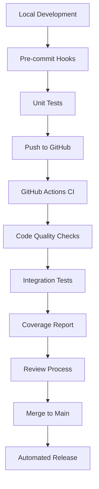

[2025-03-27 01:36:48] - Python Project Development Patterns

1. Project Structure Pattern

```
project_name/
├── .github/
│   └── workflows/
│       └── python-ci.yml
├── src/
│   └── project_name/
│       ├── __init__.py
│       ├── core/
│       ├── utils/
│       └── cli/
├── tests/
│   ├── __init__.py
│   ├── conftest.py
│   ├── unit/
│   └── integration/
├── .gitignore
├── .pre-commit-config.yaml
├── pyproject.toml
├── poetry.lock
└── README.md
```

2. Development Workflow Pattern



3. Code Quality Gates

- Pre-commit hooks for local checks
- GitHub Actions for CI/CD
- Branch protection rules
- Code review requirements
- Coverage thresholds

4. Environment Management

- Poetry for dependency management
- UV for package operations
- Virtual environments per project
- Consistent Python versions

5. Testing Practices

- pytest for test framework
- Coverage reporting
- Fixture patterns
- Test categorization

6. Documentation Standards

- README.md template
- Docstring formats
- Type hints
- API documentation

7. VS Code Integration

- Settings synchronization
- Debug configurations
- Task automation
- Extension management

8. Version Control

- Branch naming conventions
- Commit message format
- PR templates
- Release tagging

9. Automation Points

- Code formatting
- Import sorting
- Security checks
- Dependency updates
