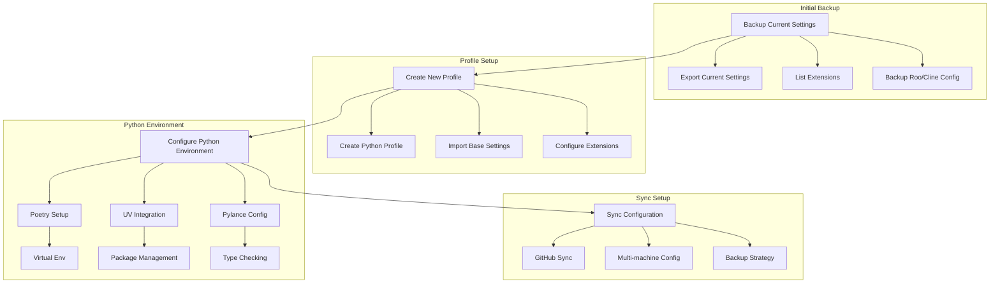

# VS Code Python Profile Setup Plan

## Overview
This plan details the setup of a VS Code profile optimized for Python development using Poetry and UV, with full Pylance integration and GitHub sync capabilities.

## Implementation Plan



## Configuration Details

### 1. Base Profile Settings
```json
{
  "settings.sync": {
    "keybindings": true,
    "extensions": true,
    "userSettings": true
  }
}
```

### 2. Python Environment
```json
{
  "python.defaultInterpreterPath": "${workspaceFolder}/.venv/bin/python",
  "python.poetry.activateVenv": true,
  "python.packageManager": "poetry",
  "python.analysis.typeCheckingMode": "strict",
  "python.analysis.diagnosticMode": "workspace",
  "python.analysis.autoImportCompletions": true
}
```

### 3. Poetry + UV Integration
```json
{
  "poetry.settings": {
    "virtualenvs.in-project": true,
    "virtualenvs.create": true
  },
  "python.terminal.activateEnvInCurrentTerminal": true,
  "python.terminal.activateEnvironment": true,
  "terminal.integrated.defaultProfile.osx": "bash"
}
```

### 4. Pylance Configuration
```json
{
  "python.analysis.diagnosticSeverityOverrides": {
    "reportGeneralTypeIssues": "error",
    "reportOptionalMemberAccess": "warning",
    "reportOptionalSubscript": "warning"
  },
  "python.analysis.inlayHints.functionReturnTypes": true,
  "python.analysis.inlayHints.variableTypes": true
}
```

### 5. Multi-Machine Sync
```json
{
  "settingsSync.ignoredSettings": [
    "-python.defaultInterpreterPath",
    "-python.condaPath"
  ],
  "settingsSync.ignoredExtensions": [],
  "settingsSync.keybindingsPerPlatform": true
}
```

## Implementation Steps

1. **Backup Phase**
   - Export current VS Code settings
   - Document installed extensions
   - Backup Roo/Cline configurations

2. **Profile Creation**
   - Create new profile "Python Development"
   - Import preserved settings
   - Configure Python-specific settings

3. **Environment Setup**
   - Configure Poetry integration
   - Set up UV package manager
   - Enable Pylance features

4. **Sync Configuration**
   - Enable GitHub settings sync
   - Configure multi-machine settings
   - Set up backup strategy